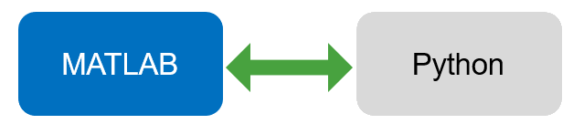
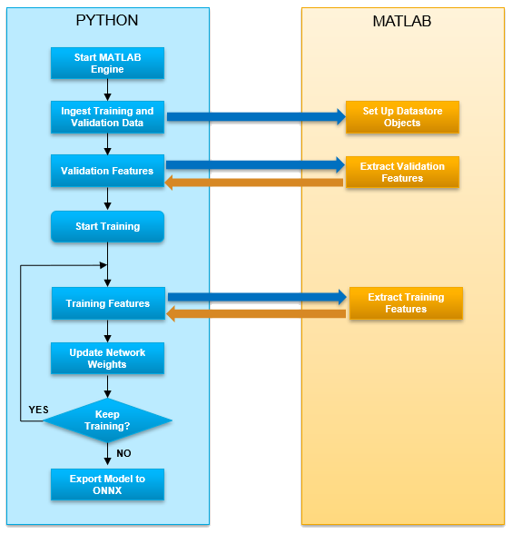
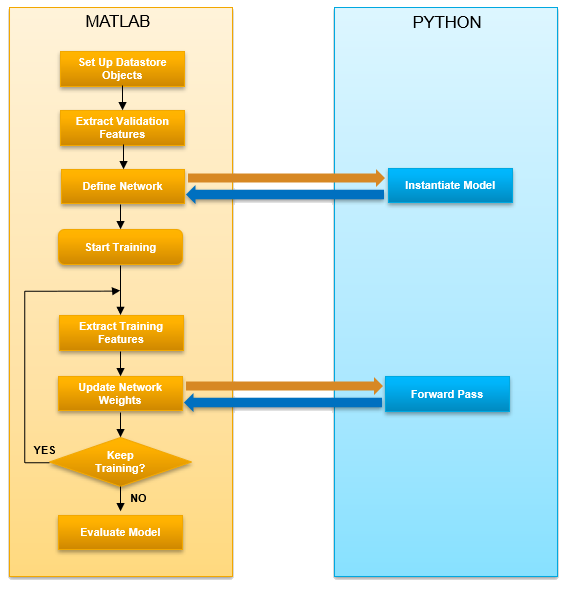

# PyTorch and TensorFlow Co-Execution for Speech Command Recognition
This repo provides examples of co-executing MATLAB&reg; with TensorFlow and PyTorch to train a speech command recognition system.

Signal processing engineers that use Python to design and train deep learning models are still likely to find MATLAB&reg; useful for tasks such as dataset curation, signal pre-processing, data synthesis, data augmentation, and feature extraction. Open-source alternatives exist for those tasks and they could be OK to use when replicating a pre-existing model or training recipe. However, for original technical development work, most users find those tasks easier in MATLAB&reg;.

**Creator**: MathWorks&reg; Development

## Requirements
- [Python&trade;](https://www.python.org/)
- [MATLAB&reg;](http://www.mathworks.com) R2021a or later
- [Deep Learning Toolbox&trade;](https://www.mathworks.com/products/deep-learning.html)
- [Audio Toolbox&trade;](https://www.mathworks.com/products/audio.html)

To accelerate training, a GPU and the following toolbox is recommended:

- [Parallel Computing Toolbox&trade;](https://www.mathworks.com/products/parallel-computing.html)

This repo includes two co-execution examples, with additional requirements.
### ``CallMATLABFromPythonPytorch.mlx``
- [PyTorch](https://pytorch.org/) (tested with version 1.9.0) and [NumPy](https://numpy.org/) (tested with 1.21.1)
- [MATLAB Engine API](https://www.mathworks.com/help/matlab/matlab_external/install-matlab-engine-api-for-python-in-nondefault-locations.html)
### ``CallPythonTensorFlowFromMATLAB.mlx``
- [TensorFlow](https://www.tensorflow.org/) (tested with version 2.0.0)
- [Configured Python interpreter](https://www.mathworks.com/help/matlab/ref/pyenv.html)

## Get Started
See ``SetupNotes.mlx`` for setup instructions for both examples included with this repo.

There are two high-level examples in this repo.
### Call MATLAB from Python
``CallMATLABFromPythonPytorch.mlx`` - In this example, Python&trade; is your main environment. You call into MATLAB&reg; to perform dataset management and audio feature extraction.

### Call Python from MATLAB
``CallPythonTensorFlowFromMATLAB.mlx`` - In this example, MATLAB&reg; is your main environment. The dataset management, audio feature extraction, training loop, and evaluation happen in MATLAB&reg;. The deep learning network is defined and executed in Python&trade;.

## License
The license is available in the [License](LICENSE) file in this repository.
